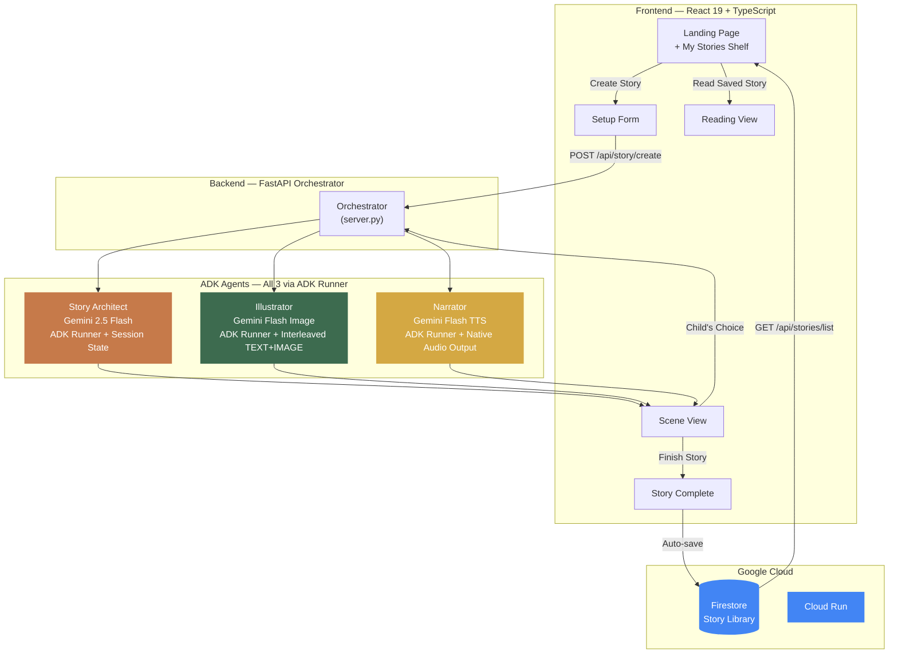
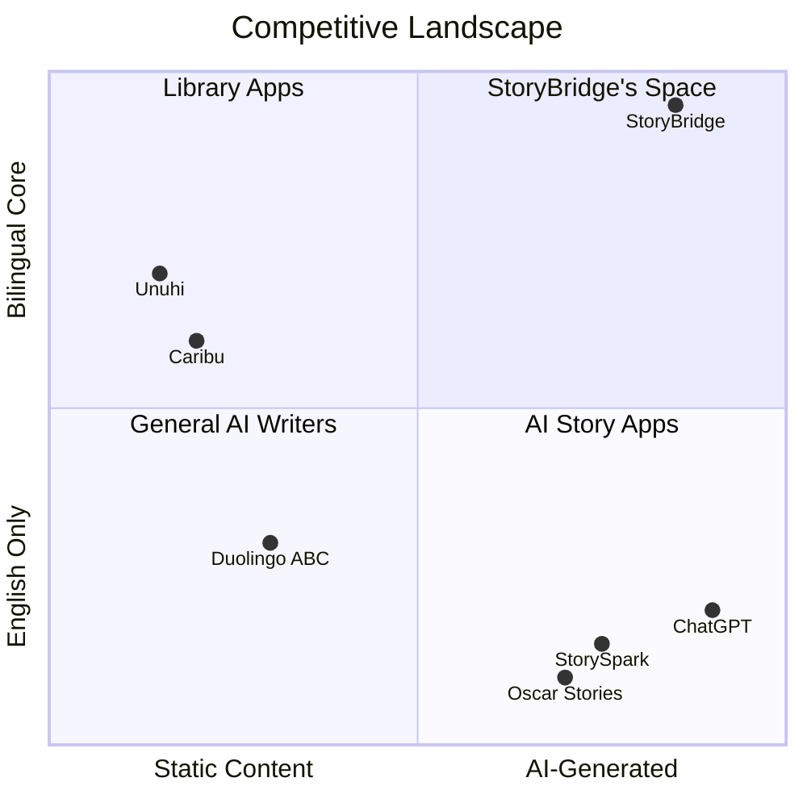
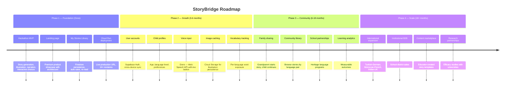

# StoryBridge — Bilingual Family Storytelling Companion

**Where languages meet through the magic of storytelling.**

> _Built by [Pyae Sone Kyaw](https://pseonkyaw.dev) — a Burmese engineer in Paris, building the bridge he wished he had growing up._

**[Try StoryBridge Live](https://storybridge-469521173814.us-central1.run.app/)** | [Demo Video](#demo) | [Architecture](#architecture) | [How It Works](#how-it-works)

---

## The Problem

Every night, millions of immigrant parents face an invisible wall. They want to read bedtime stories to their children — but their native language and their child's adopted language create a gap that no ordinary book can bridge.

**Heritage language loss is a crisis, not a statistic:**

| Generation           | % Who Speak Heritage Language | Source               |
| -------------------- | ----------------------------- | -------------------- |
| 1st (immigrants)     | 90%+                          | Princeton            |
| 2nd (their children) | ~50%                          | Penn State           |
| 3rd (grandchildren)  | **12%**                       | Princeton/Penn State |

- **281 million** international migrants worldwide
- **75 million** people in the US speak a non-English language at home
- By the 3rd generation, **only 12%** of immigrant children speak their heritage language fluently
- Language shift begins **the moment children enter school** (Harvard Immigration Initiative)

**Families are literally losing the ability to talk to each other across generations.**

---

## The Solution

StoryBridge is an AI-powered, interactive storytelling companion that creates **personalized bilingual bedtime stories** — bridging a parent's native language with their child's adopted language through culturally-rich narratives, watercolor illustrations, and warm bilingual narration.

Every story is unique. Every choice matters. Every scene builds a bridge between two worlds.

---

## How It Works


| Step                     | What Happens                                                                                                            |
| ------------------------ | ----------------------------------------------------------------------------------------------------------------------- |
| **Choose Your Language** | Select from 20+ supported languages — Burmese, Spanish, Arabic, Hindi, Mandarin, and more                               |
| **Set the Scene**        | Pick a theme, add cultural elements (festivals, foods, traditions), optionally provide a story seed                     |
| **Experience the Story** | Each scene features bilingual text, a watercolor illustration, and warm audio narration in both languages               |
| **Shape the Story**      | Your child makes choices that genuinely change the narrative — each choice generates a brand new scene via the AI agent |

**5 scenes per story. 4 interactive choices. 2 languages bridged. 1 magical bedtime experience. Every story saved to your library.**

---

## Key Features

| Feature                      | Description                                                                                                        |
| ---------------------------- | ------------------------------------------------------------------------------------------------------------------ |
| **Bilingual Narratives**     | Side-by-side text in parent's language + English — natural in both, never awkward translations                     |
| **Watercolor Illustrations** | Culturally authentic storybook art generated in real time for every scene                                          |
| **Audio Narration**          | Warm, expressive TTS in both languages — native language first, then English                                       |
| **Interactive Choices**      | Children shape the story with their decisions. Each choice generates a new scene via ADK agent with full context   |
| **Cultural Authenticity**    | Stories weave in real cultural elements — festivals, landmarks, traditions, foods                                  |
| **20+ Languages**            | Burmese, Spanish, Mandarin, Arabic, Hindi, French, Portuguese, Vietnamese, Korean, Japanese, and more              |
| **Age-Appropriate**          | Content adapts for children ages 3-10 with appropriate vocabulary and themes                                       |
| **Voice Input**              | Children can speak their choices via Web Speech API — beyond the text box for natural interaction                  |
| **My Stories Library**       | Every completed story auto-saves to Google Cloud Firestore. Re-read any story scene by scene from the landing page |

---

## Architecture

StoryBridge uses a **multi-agent architecture** powered by Google's Agent Development Kit (ADK) with three Gemini modalities working in concert.



### Why This Architecture

**Root Orchestrator with Sub-Agent Delegation** — The `root_agent` (with `sub_agents=[story_architect, illustrator, narrator]`) runs as the primary ADK Runner. Story generation flows through the Orchestrator's coordination logic, which delegates to the Story Architect sub-agent. This is true multi-agent orchestration through ADK, not a wrapper.

**All 3 Agents via ADK Runner** — Every agent runs through Google ADK's `Runner`. The Story Architect uses `InMemorySessionService` to maintain conversation state across scenes — each child's choice is sent to the **same agent session**, producing genuinely adaptive narratives. The Illustrator and Narrator each get per-request ADK sessions for stateless multimodal generation.

**SSE Streaming (Fluid Output)** — The `/api/story/create/stream` endpoint streams story generation word-by-word via Server-Sent Events. Text appears progressively in the loading screen as the Orchestrator agent generates through ADK Runner — demonstrating Gemini's real-time creative output.

**Native Interleaved Output** — The Illustrator agent produces TEXT + IMAGE in a single ADK Runner generation, using Gemini's native interleaved multimodal output — a core Creative Storyteller capability. The Narrator agent produces native AUDIO output through ADK Runner.

**Voice Input** — Children can speak their choices via the Web Speech API, moving beyond text-only interaction for a more natural, immersive storytelling experience.

**Parallel Media Loading** — Illustration and narration load concurrently via `Promise.allSettled`, with independent retry logic and direct API fallbacks. One failure doesn't block the other.

### API Endpoints

| Endpoint                   | Method | Purpose                                                                 |
| -------------------------- | ------ | ----------------------------------------------------------------------- |
| `/health`                  | GET    | Health check                                                            |
| `/api/story/create`        | POST   | Create story outline + first scene via ADK Orchestrator agent           |
| `/api/story/create/stream` | POST   | SSE streaming version — word-by-word fluid output via ADK Runner        |
| `/api/scene/illustrate`    | POST   | Generate watercolor illustration using Illustrator agent config         |
| `/api/scene/narrate`       | POST   | Generate bilingual audio (split per language for clean output)          |
| `/api/scene/choice`        | POST   | Submit child's choice, generate next scene via ADK agent (same session) |
| `/api/session/{id}`        | GET    | Retrieve full session state                                             |
| `/api/stories/save`        | POST   | Save completed story to Firestore                                       |
| `/api/stories/list`        | GET    | List saved stories by browser ID (newest first, max 20)                 |
| `/api/stories/{id}`        | GET    | Get full saved story for re-reading                                     |
| `/api/stories/{id}`        | DELETE | Delete a saved story                                                    |

---

## Tech Stack

| Layer                | Technology                                              |
| -------------------- | ------------------------------------------------------- |
| **Frontend**         | React 19, TypeScript (strict), Vite 6                   |
| **Backend**          | Python 3.10, FastAPI, Uvicorn                           |
| **AI Framework**     | Google ADK (Agent Development Kit)                      |
| **Story Generation** | Gemini 2.5 Flash via ADK Runner                         |
| **Image Generation** | Gemini 2.5 Flash Image (native image gen)               |
| **Text-to-Speech**   | Gemini 2.5 Flash Preview TTS (L16 PCM 24kHz)            |
| **Storage**          | Google Cloud Firestore (story persistence)              |
| **Deployment**       | Google Cloud Run (multi-stage Docker)                   |
| **Design**           | Custom CSS design system — warm earth tones, no AI slop |

---

## Quick Start

### Prerequisites

- Python 3.10+
- Node.js 18+
- Google Cloud account with [Gemini API key](https://aistudio.google.com/apikey)

### Backend

```bash
cd backend
python -m venv .venv
source .venv/bin/activate  # Windows: .venv\Scripts\activate
pip install -r requirements.txt

cp .env.example .env
# Edit .env with your GOOGLE_API_KEY

python -m uvicorn server:app --host 0.0.0.0 --port 8000
```

### Frontend

```bash
cd frontend
npm install
npm run dev  # runs on port 5173, proxies /api to localhost:8000
```

### Docker (Production)

```bash
docker build -t storybridge .
docker run -p 8080:8080 \
  -e GOOGLE_API_KEY=your_key \
  -e GOOGLE_GENAI_USE_VERTEXAI=FALSE \
  -e GOOGLE_CLOUD_PROJECT=storybridge-hackathon \
  storybridge
```

### Deploy to Cloud Run

```bash
gcloud run deploy storybridge \
  --source . \
  --region us-central1 \
  --allow-unauthenticated \
  --set-env-vars "GOOGLE_API_KEY=$GOOGLE_API_KEY,GOOGLE_GENAI_USE_VERTEXAI=FALSE,GOOGLE_CLOUD_PROJECT=storybridge-hackathon" \
  --memory 1Gi \
  --timeout 300
```

---

## Project Structure

```
storybridge/
├── backend/
│   ├── server.py                 # FastAPI orchestrator — coordinates all agents
│   ├── agents/
│   │   ├── story_architect.py    # ADK Agent — bilingual story generation (Runner + Session)
│   │   ├── illustrator.py        # ADK Agent — watercolor illustration config
│   │   ├── narrator.py           # ADK Agent — bilingual TTS config
│   │   └── orchestrator.py       # Root agent definition (architecture docs)
│   ├── requirements.txt
│   ├── .env.example
│   └── Dockerfile
├── frontend/
│   ├── public/
│   │   └── favicon.svg           # Book-bridge SVG favicon
│   ├── src/
│   │   ├── App.tsx               # Main SPA — landing, setup, scene, reading, completion phases
│   │   ├── main.tsx
│   │   └── styles/global.css     # Design system (earth tones, storybook aesthetic)
│   ├── package.json
│   ├── tsconfig.json
│   └── vite.config.ts
├── docs/
│   ├── DEMO-SCRIPT.md            # 4-minute demo video script
│   └── FEATURE-MY-STORIES.md     # My Stories library feature spec + Supabase schema
├── Dockerfile                    # Multi-stage build (Node + Python)
└── README.md
```

---

## Product-Market Fit

### The White Space

No competitor combines ALL of these: AI-generated stories + bilingual by design + heritage language preservation mission + cultural authenticity + bilingual audio narration + interactive choices.



### Addressable Market

| Segment                      | Size            | Growth             |
| ---------------------------- | --------------- | ------------------ |
| Global EdTech                | $234B (2025)    | 14.5% CAGR         |
| Bilingual Education          | $15-18B         | $45B by 2033       |
| K-12 Dual Language Immersion | $4.3B           | 12.9% CAGR         |
| Kids Apps                    | $22.34B by 2035 | 49% integrating AI |

**StoryBridge's addressable niche:** Bilingual education + kids apps + AI personalization = **$500M-$1B globally**.

### Research Backing

- Bilingual children's word usage in stories is highly correlated with **cognitive flexibility** (ScienceDaily, 2019)
- Early storytelling skills in one language **positively transfer** to the other (Cambridge University Press)
- Multilingual storytelling engages young learners **more effectively** than traditional methods (Ollerhead & Pennington)
- Both language acquisition and narrative development **peak at ages 3-10** (PMC, 2024)

**StoryBridge isn't entertainment — it's a research-backed intervention for heritage language preservation.**

---

## Limitations

| Limitation                  | Details                                                     | Mitigation                                                 |
| --------------------------- | ----------------------------------------------------------- | ---------------------------------------------------------- |
| **Session-Based Identity**  | Stories linked to browser UUID, not user accounts           | Supabase Auth planned for v2 (email/Google OAuth)          |
| **Single Voice**            | Same TTS voice (Kore) for all languages                     | Gemini TTS limitation; improves with model updates         |
| **No Offline Mode**         | Requires internet for all AI generation                     | Saved stories can be re-read offline (text only, no media) |
| **Language Quality Varies** | Some language pairs produce better translations than others | Gemini supports 100+ languages but quality varies          |
| **No Image Caching**        | Illustrations not persisted; re-read view is text-only      | Cloud Storage caching planned for v2                       |

---

## Future Work



### Moat Building Strategy

| Priority | Feature                                  | Moat Type                | Status     |
| -------- | ---------------------------------------- | ------------------------ | ---------- |
| 0        | **Story library (Firestore)**            | Emotional switching cost | **DONE**   |
| 1        | User accounts + cross-device sync        | Identity lock-in         | Month 1-2  |
| 2        | Child profiles (age, level, preferences) | Personalization lock-in  | Month 2-3  |
| 3        | Family sharing (cross-generational)      | Network effect           | Month 3-6  |
| 4        | Vocabulary tracking per language         | Data moat                | Month 4-6  |
| 5        | Community story library                  | Content network effect   | Month 6-12 |
| 6        | Heritage language school partnerships    | Distribution + brand     | Month 6-18 |

---

## Hackathon Submission

**Competition:** [Gemini Live Agent Challenge](https://devpost.com/) on Devpost
**Category:** Creative Storyteller — Multimodal storytelling with interleaved text, images, and audio
**Deadline:** March 16, 2026, 8:00 PM EDT

### What Makes This a Strong Submission

- **Root Orchestrator with sub-agent delegation** — `root_agent` coordinates `story_architect`, `illustrator`, `narrator` sub-agents through ADK Runner
- **All 3 agents through ADK Runner** — Story Architect (session state), Illustrator (interleaved TEXT+IMAGE), Narrator (native AUDIO)
- **SSE streaming for fluid output** — Story text streams word-by-word via Server-Sent Events as the agent generates
- **Native interleaved multimodal output** — Illustrator produces text + image in a single ADK generation
- **Three Gemini modalities** used meaningfully — text generation, image generation, and TTS
- **Voice input** — children speak their choices via Web Speech API (beyond the text box)
- **Real interactivity** — children's choices generate new scenes via the agent with full conversation context
- **Persistent story library** — completed stories saved to Firestore, re-readable from the landing page
- **Deployed to production** on Google Cloud Run with a live URL (14+ revisions)
- **Emotionally compelling** problem — heritage language loss affects 281M+ migrants worldwide
- **Blue ocean positioning** — no direct competitor combines all these capabilities

### Google Cloud Services Used

| Service          | Model / Product                | Purpose                                       |
| ---------------- | ------------------------------ | --------------------------------------------- |
| Text Generation  | `gemini-2.5-flash`             | Bilingual story creation via ADK Runner       |
| Image Generation | `gemini-2.5-flash-image`       | Watercolor storybook illustrations            |
| Text-to-Speech   | `gemini-2.5-flash-preview-tts` | Bilingual audio narration (Kore voice, 24kHz) |
| Cloud Firestore  | Native mode, us-central1       | Persistent story library (save/list/read)     |
| Cloud Run        | Multi-stage Docker             | Production deployment (14+ revisions)         |

---

## Design Philosophy

**No AI slop.** Every design decision is intentional:

- **Earth tones** — Cream, terracotta, forest green, deep brown. Warm and inviting.
- **Typography** — Crimson Pro (serif) for story text, Inter (sans-serif) for UI. Like a real picture book.
- **No gradients** — Solid colors only. Gradients scream "AI-generated."
- **Watercolor aesthetic** — Illustrations prompted for warm, soft, storybook watercolor style.
- **Whitespace** — Generous padding. The app should feel like opening a beautiful book.

---

## Team

**Pyae Sone Kyaw** — Founding AI Engineer at [Siloett.AI](https://siloett.ai) (Station F, Paris)

- Dual Master's: Telecom SudParis + Asian Institute of Technology
- Background: Data Science, transitioning to Full-Stack AI Engineering
- [Portfolio](https://pseonkyaw.dev) | [GitHub](https://github.com/soneeee22000) | [LinkedIn](https://linkedin.com/in/pyaesonekyaw)

---

## License

MIT

---

<p align="center">
  <strong>StoryBridge</strong> — Where languages meet through the magic of storytelling.
  <br/>
  <a href="https://storybridge-469521173814.us-central1.run.app/">Try it live</a>
</p>
